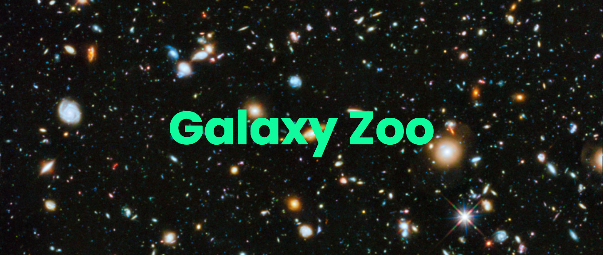

<p align="center">
	<a>
		
	</a>
</p>

<p align="center">
	<a href="https://www.python.org/downloads/release/python-380/">
		
	</a>
	<a href="https://pytorch.org/">
		
	</a>
	<a href="https://github.com/psf/black">
		
	</a>
</p>

This project is derived from an assignement I did during my bootcamp at Yotta Academy.
It aims to classify the morphologies of distant galaxies using deep neural networks.

It is based on the Kaggle [Galaxy Zoo Challenge](https://www.kaggle.com/c/galaxy-zoo-the-galaxy-challenge/overview).


# Documentation
A few related papers on the topic are available here:
- [1308.3496](https://arxiv.org/abs/1308.3496)
- [1807.10406](https://arxiv.org/abs/1807.10406)
- [1809.01691](https://arxiv.org/abs/1809.01691)

To better understand the task to be learned by the model, give it a go yourself: [try it here](https://www.zooniverse.org/projects/zookeeper/galaxy-zoo/classify).


# Installation

1. (Optional) Install [poetry](https://python-poetry.org/) if you don't have it already (I highly recommend it!):
```bash
make setup-poetry
```

2. Set yourself a virtual environment with python 3.10, e.g. using [pyenv](https://github.com/pyenv/pyenv) or [miniconda](https://docs.conda.io/en/latest/miniconda.html) (easier IMO):
```bash
conda create --name gzoo python=3.10  # miniconda
conda activate gzoo
# or
pyenv install 3.10:latest  # pyenv
pyenv local 3.10:latest  # run in this directory
```

3. Within this environment, install the project's dependencies:
```bash
poetry install
```

4. To download the dataset (you'll need to login with [Kaggle's API](https://github.com/Kaggle/kaggle-api) first) run:
```bash
make download-dataset
```

5. Ensure your gpu driver is properly working for pytorch to use it (the name of your device should appear):
```bash
nvidia-smi
```

6. (Optional) If you intend to contribute in this repo, run:
```bash
pre-commit install
```

You're good to go!


# Train
## Create the training labels for classification
```bash
poetry run python -m gzoo.app.make_labels <data_dir>
```
required arguments:
- `<data_dir>`: specifies the location of the dataset directory containing the original regression labels from the dataset `training_solutions_rev1.csv`

## Run the classification pipeline:
```bash
poetry run python -m gzoo.app.train -o config/train_classification.yaml
```
script option:
- `-o`: specify the `.yaml`config file to read options from.
Every run config option should be listed in this file (the default file for this is [config/train_classification.yaml](config/train_classification.yaml)) and every option in the `yaml` file can be overloaded *on the fly* at the command line.

For instance, if you are fine with the values in the `yaml` config file but you just want to change the `epochs` number, you can either change it in the config file *or* you can directly run:
```bash
poetry run python -m gzoo.app.evaluate -o config/train.yaml --epochs 50
```
This will use all config values from `config/train.yaml` except the number of epochs which will be set to `50`.

main run options:
- `--seed`: seed for initializing training. (default: `None`)
- `--epochs`: total number of epochs (default: `90`)
- `--batch-size`: batch size (default: `256`)
- `--workers`: number of threads (default: `4`)
- `--model.arch`: model architecture to be used(default: `resnet18`)
- `--model.pretrained`: use pre-trained model (default: `False`)
- `--optimizer.lr`: optimizer learning rate (default: `3.e-4` with Adam)
- `--optimizer.momentum`: optimizer momentum (default: `0.9`)
- `--optimizer.weight-decay`: optimizer weights regularization (L2) (default `1.e-4`)


# Predict
```bash
poetry run python -m gzoo.app.predict -o config/predict.yaml
```
Config works the same way as for training, default config is at [config/predict.yaml](config/predict.yaml).
The `dataset` directory specified in the config must contain an `images_test_rev1` folder that contains itself the images to predict, as well as the `all_ones_benchmark.csv` output template from the Kaggle project's data sources.

A 1-image example is provided which you can run with:
```bash
poetry run python -m gzoo.app.predict -o config/predict.yaml --dataset.dir=example/
```
